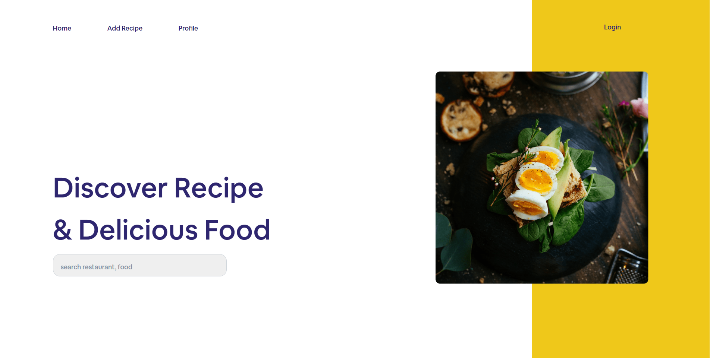
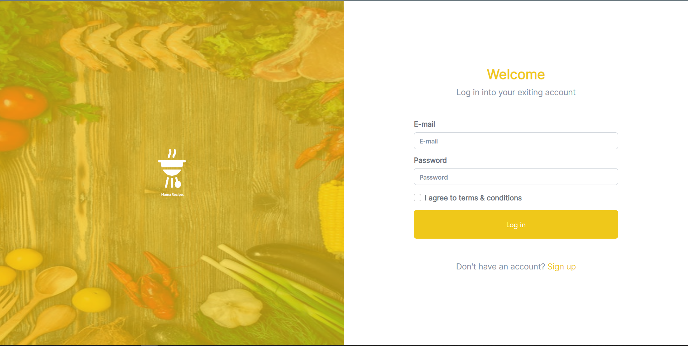

# Food Recipe Portfolio  🍔🍰🍕

## Project Description 📜

Food Recipe is a dynamic online platform that allows users to share their own recipes with others while also exploring a wide range of culinary creations contributed by other users. The platform aims to create a vibrant community of food enthusiasts who can connect, learn, and appreciate the art of cooking together.

## Technologies Used 🚀

The Food Recipe project is built using the following technologies:

- HTML
- CSS
- JavaScript
- Bootstrap
- JQuery
- Node.Js
- Express.Js
- JWT (JSON Web Tokens)
- XSS (Cross-Site Scripting) Protection
- CORS (Cross-Origin Resource Sharing)
- ESLint (Linting tool for code quality)
- Redis (In-memory data store)
- Cloudinary (Cloud-based image and video management)
- PostgreSql (Relational Database)

## Project Repository 📂

The Back End repository for this project can be found on GitHub at the following link:
[Food Recipe Backend Repository](https://github.com/IrhamNfrnda/food-recipe-be)

The Mobile App repository for this project can be found on GitHub at the following link:
[Food Recipe Mobile App Repository](https://github.com/IrhamNfrnda/Food-Recipe-App)

## Features ✨

- User registration and authentication with JWT
- Create, edit, and delete user recipes
- Browse and search for recipes
- Like and comment on recipes
- Image and video upload for recipes using Cloudinary
- Protection against XSS attacks
- Cross-Origin Resource Sharing for secure API access
- Linting with ESLint for maintaining code quality
- Data caching with Redis for improved performance

## Screenshots 📸

<table>
   <tr>
    <td></td>
    <td> </td>
  </tr>
</table>

## Getting Started 🚀

To set up the Food Recipe project locally, follow these steps:

1. Clone the backend repository from the provided link.
2. Install the required dependencies using npm.
3. Set up your PostgreSQL database and update the configuration accordingly.
4. Set up Cloudinary account and update the credentials in the project.
5. Ensure you have Node.js and npm installed on your system.
6. Start the server using the command `npm start`.
7. Access the project through your preferred web browser.

## Contributions 🤝

Contributions to the Food Recipe project are welcome. If you find any issues or have suggestions for improvements, please feel free to open an issue or create a pull request in the backend repository.

## License 📝

This project is licensed under the MIT License - see the [LICENSE](LICENSE) file for details.

## Contact 📞

If you have any questions or inquiries regarding this project, feel free to contact me at [irhamnfrnda@gmail.com](mailto:irhamnfrnda@gmail.com).

---

Happy cooking and sharing your recipes with the Food Recipe community!
